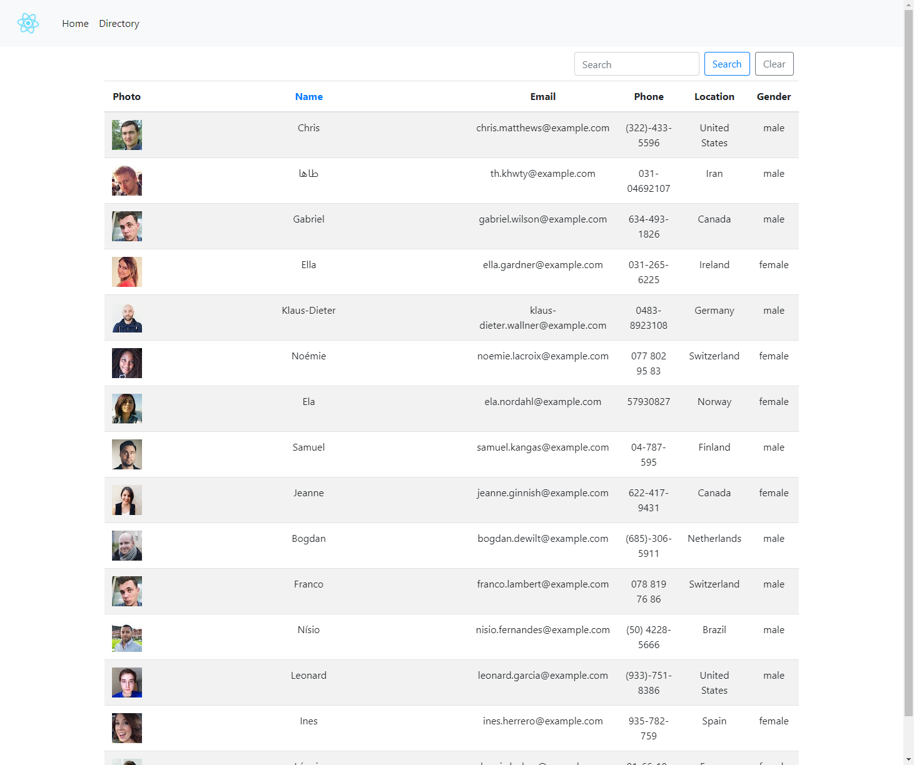
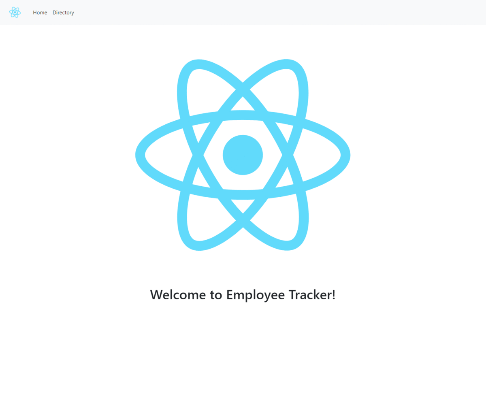

# GT-Homework-19-Employee-Directory

An employee directory created with React.

## Description

An employee or manager can view non-sensitive data about other employees. Employees can be sorted or filtered by search. This project was bootstrapped with [Create React App](https://github.com/facebook/create-react-app).

## Table of Contents

* [Installation](#installation)
* [Usage](#usage)
* [Contributing](#contributing)
* [Repository](#repository)
* [Questions](#questions)
* [License](#license)

## Installation

Download or clone the project to your system with the `clone or download` button on the page.
In the project directory, you can run:

`npm intall`

to install the required node packages for app functionality.

## Usage

In the project directory, you can run:

`npm start`

Runs the app in the development mode. 
Open [http://localhost:3000](http://localhost:3000) to view it in the browser.

The application will open on a Home splash screen.  Clicking the Directory tab at the top of the display will redirect your view to a randomly generated list of "employees". The list of employees can be filtered by using the search textbox above, or sorted by clicking on the highlighted list header.

## Contributing

None.

## Repository

[Github Repository](https://github.com/AlanAshworth/gt-homework-19-employee-directory)

## Questions

Contact me at <a href="mailto:awashworth927@gmail.com">awashworth927@gmail.com</a>

## License

© 2019 Trilogy Education Services, a 2U, Inc. brand. All Rights Reserved.